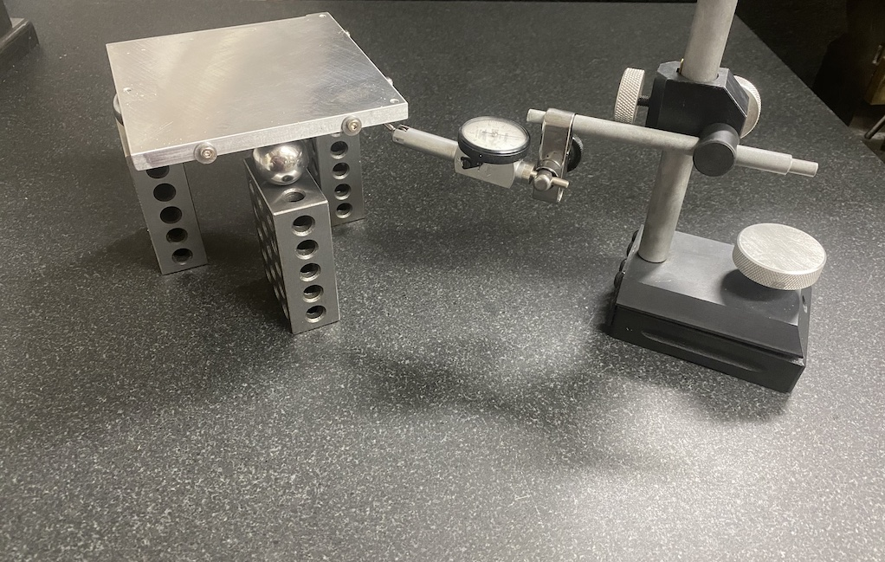
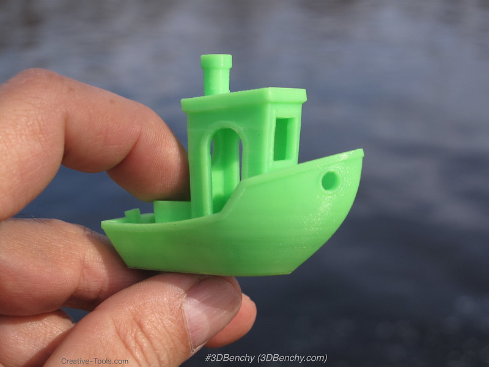

# Mechanical tips

## AKA: A Machinist's Guide to building a 3D Printer

This guide is intended for people that are building a 3D printer (presumably
a Voron) and want to ensure that it's assembled as accurately as possible.

A huge fraction of printing issues can be traced back to purely mechanical
issues (versus slicer or printer configuration settings). It pays to get the
mechanics right as early as possible, but the information in this guide is
equally useful for troubleshooting an existing machine.

While the author knows a little bit about many things, it may be worth reviewing
the [caveats](#Caveats) at the end of this document.

## Caveats

### By a beginner and for beginners

I still considers myself a beginner at 3D printing, not an expert. I
did, however, receive a EE degree in the early eighties and have spent a lifetime
making and rebuilding machines of all sorts (from guitars and ukuleles to heavy
precision machine tools). I was an absolute expert at making dust, chips,
swarf, and other debris from every material imaginable even before I discoverd
the joys of smearing molten ABS plastic over a heated bed.

This guide intentionally assumes very little from the reader. I'd 
rather risk annoying advanced readers with "obvious" details than to assume
knowledge another beginner might not possess.

### Voron0 model-specific

To prevent getting bogged down in if-this-then-that, this guide focuses on the
Voron0 printer model specifically (not least because that is the only Voron I've
built thus far). The information is _absolutely_ applicable to other
Voron models, however (or any FDM printer for that matter).  Even builders who
have recently built Vorons with fancy bed probes, flying gantries, and
hot-rodded extruders and tool-heads will benefit from what's written here.

### Opinionated documentation

To borrow a principle from the software development world, this guide is proudly
_opinionated_ documentation. Instead of laboring through a zillion different
options and weighing the pros and cons of each, it describes what
works well for me. Of course there are other, possibly even better, ways
to do things. You are, of course, free to disagree and deviate from anything
written here. It's okay to be _wrong_.

Kidding aside, what follows indisputably **WORKS**. Deviate with care.

### Required tools

I'm fortunate enough to have accumulated a lifetime of tools, and it's tempting
to prescribe a specific, purpose-built tool for every operation described below,
but it's unreasonable to expect that readers who aren't close to retirement will
have access to expensive metrology equipment or a lathe, for example.

The [tools appendix](#tools) includes a list of mandatory, indispensable tools as well as
other highly desirable tools. I've struggled to keep the former list as short as
absolutely possible.

Whenever possible, I've also taken pains to describe "field
expedient" techniques that don't require expensive tools or can use the printer
itself as a measuring tool.

## Mechanics

Every 3D printer tuning guide ever written stresses the importance of physical
_mechanics_. 

Printer parts that are supposed to stay put must be rigid and secure. Parts
that are supposed to move freely, should. The geometric relationships between
parts must be precisely maintained even as the toolhead and/or bed moves about.

Yet beginners anxious to start printing often just **gloss over** the
advice at the start of these guides, thinking, "I just carefully _assembled_
the darn thing, **of course** all the screws are tight!"

Easily 90% of all printing problems come down to mechanical issues, however, and
no amount of fiddling with slicer or firmware configuration will solve these
issues. It pays to slowly and thoroughly double-check everything described
below, even if you **just** put the printer together.

### Bottom up, outside in

Verify the following items in this order to ensure your machine is
operating properly:

1. Is the build surface as **flat** as possible?
2. Are the fixed frame components **straight**, **rigidly** assembled, and
   **square** to one another?
3. Are movable parts properly **constrained** so they only move in one
   dimension?
4. Are **geometric relationships** maintained as parts move (especially the
   nozzle to the bed, but this also applies to gantries, motor-shafts, belts, gears,
   idlers, and leadscrews.)
5. Do movable parts move **smoothly** without hitches and hiccups from dirt, poor
   surface finish, improper alignment, or poor machining (parts out-of-round or
   not straight)?
   a. Outside: motion components (gantries, belts, and leadscrews) manually and
   under power.
   b. Inside: the filament path from spool to nozzle, manually and under power.
## 0. Unplug

Before moving the toolhead manually, always unplug the power cable and, if at all
feasible, remove the stepper motor cables from the MCU on your printer (if you
didn't label all your connectors, now is a good time to do so). Many builders
have learned to put connectors at the motor end as well as the MCU end of the
cables so they can swap out a failed motor easily if necessary. Disconnect
whichever end is easiest for every stepper motor except the extruder.

Moving belts or leadscrews while attached to stepper motors can induce back-EMF,
effectively turning a motor into a generator. As long as you only make slow
moves, it's highly unlikely you'll damage anything by moving the toolhead or
leadscrew around by hand, but the circuitry isn't designed for power to flow in
that direction, so unplugging the motors is cheap insurance. Do it.

## 1. Verify the build surface is flat

### 1.1 The correct approach

In the unlikely event that it's easy to remove the bed from your printer **and**
you have access to a surface plate and metrology equipment, the correct manual
method to indicate flatness is as follows:

Rest the surface under test (the "top" of your build surface) by three support
points resting on a surface plate. A simple "point" can be achieved with a ball
bearing resting in a hole on a 1-2-3 block. All three points should be the same
distance from the surface plate. You can also use three machinist jacks and
adjust with an indicator until all are the same height.

You then simply indicate the surface from _underneath_, zeroing the indicator at any
convenient location and verifying the same reading at every location you can
reach.

In a modern machine shop, this would be accomplished with a
coordinate-measuring machine (CMM) but anyone with one of _those_ in a home shop
is unlikely to be reading this!

### 1.2 The field expedient approach

A calibrated surface plate and decent dial test indicator alone are probably
too expensive for most, likely costing more than your printer (much less a CMM).

There's no getting around the need for some sort of reasonably flat surface to
use as a reference "surface plate," but refer to the [section on tools](#tools) for ideas on
inexpensive alternatives.

Since we only care about approximately +/- 0.025 mm of flatness over the entire surface
of the build plate (about 0.05 mm or 0.002" from lowest point to highest), and we don't need to actually
_measure_ any deviation, we can get away with a simple "tap test" on our surface
plate to see if it's "flat enough for 3DP work."

First, clean the surface of your plate with a lint-free cloth and some sort of
cleaner (no-grit, lanolin-based hand cleaner is ideal). Then wipe the side of
your hand across the surface (better practice than using paper
towels or rags). You don't want any dirt, lint, or grit on the plate interfering with
the results, and your fingers and hands are amazingly sensitive at detecting the
tiniest particles. 

Now place the (similarly clean) "top" of your build surface against the plate.

No matter how flat your bed, at a microscopic level there are always peaks and
valleys. The main concern is if the bed is appreciably convex or concave by more
than 0.025 mm.

First, try to rotate the bed by pushing each corner from the side. Carefully
examine where the bed rotates.

If it's convex, it will spin freely in the middle like a top (that's bad).

If it's concave, it will most likely rotate at the far corner. It's also
possible that it will always rotate on one corner (the lowest) if you push
against any of the other three.

A truly flat plate will rotate about a third of the way in from the opposite
corner no matter which corner you push against.

Next, as a final test, tap each corner, the middle of each side, and the center
in turn with your finger tip (this "Union Jack" pattern is used a lot by
machinists). 

If it's flat, you will hear a solid "thunk" rather than a hollow clicking at
all locations, and there should be no discernible movement. If not, you'll now
where the "high" spots are (low spots when you are printing since the bed is
flipped for these tests).

If it's severely warped, you'll be able to fit a feeler gauge under the opposite
side when you press on one or more locations (giving you an indication of how
far it is out).

### Using the printer itself to measure

While the above tests are quite accurate, you can only perform them with the bed at
room temperature. A high quality, cast-aluminum, Blanchard-ground plate should
remain quite stable through many heat-cool cycles, but poorly made beds may move
significantly every time you heat them up, eventually settling into a shape that
is anything but flat (the dreaded "taco bed").

Once you've verified the geometric alignment of the printer and trammed the bed,
you can use copy-paper as a thickness gauge to directly _feel_ for any dips or
bumps in your build surface. [FIXME](#) below describes the process.

### 1. Verify the toolhead can move to all locations

Manually turn the Z leadscrew to raise the bed almost as high as it can go (until
it is within a millimeter or so of the nozzle). You want the nozzle close to minimize
parallax as you look from the sides.

Now manually move the toolhead to all extremes: front, back, left and right.

On a properly built machine you should be able to move the nozzle to **every**
location on the bed. It's often helpful (almost mandatory on a V0) if you can
move the nozzle past the edge of the bed in at least one direction, if only ever
so slightly (or even in at least one, possibly slightly rounded, corner).

You're wasting build volume if the nozzle can't reach some location on the bed
for whatever reason. It's well worth taking
the time to move extrusions, recess screws, sand/file, or whatever is required to
ensure the nozzle can reach **every** location on the bed.

On a V0, with a 120 mm X 120 mm bed, the near left corner as you face the machine from the front is
coordinate 0,0. The right rear is 120,120.

You're **strongly** encouraged to configure your software such that logical
coordinates correspond to physical coordinates. While other configurations are
possible and might seem sensible in some situations, you'll confuse yourself
eventually.

If you instruct your printer to move to, say, X=60, Y=120 on a V0, the nozzle
should move to the center of the very rear edge of the bed.

On a V0, any positive value for X or Y between 0 and 120 should be **on the
bed**. When you want to move the nozzle off the bed (for homing Z,
purging/priming filament, wiping the nozzle, or whatever) you will specify
either a negative coordinate or a value larger than the dimension of your bed.

## Kinematics 101

Kinematics is the "geometry of motion". Like most profound topics, the
concepts seem simple and obvious when explained, but a truly amazing
amount of complexity arises when you start studying the interaction between
those principles.

Kinematic _constraints_ prevent motion in one or more of the "six degrees of
freedom" from classical mechanics (translation along the X, Y, or Z axis, and
rotation around any of the same three axes). The Kevin Bacon axis isn't
recognized in classical analysis.

You may have heard people using the terms "fully constrained" or
"over constrained" before. These are kinematic terms.

[Don't worry, they probably didn't have a very thorough understanding of the
principles, either. After reading this section, you'll at least know how to
annoy people by pedantically correcting them when they misuse a terms. These
ideas can also help to diagnose many physical problems with a 3D printer.]

We mostly care about just three things:

1. We want to ensure that parts that are supposed to be straight and flat
   really are. (This is more about metrology and fundamental geometric constraints
   than kinematics, but it's a pre-requisite to apply kinematic principles.)

2. We want to ensure that parts that are supposed to be rigid and unmoving
   don't move no matter what is going on elsewhere.

3. We want to ensure that movable parts only move along prescribed paths, and
   that geometric relationships between moving parts (especially the nozzle and
   the bed) are maintained.

### Straight, flat, and true

Our printers depend on "straight" aluminum extrusions and linear rails to ensure our
nozzles and beds moves along straight paths.

We use precision-ground, cast-aluminum tooling plates to ensure optimal first layers on our
prints. (Bed probes and Klipper's bed mesh algorithms can adjust for a small
amount of dips and bumps, but a V0 has no probe and you'll always get the best
prints from a truly flat bed, anyway.)

You've probably also heard that you should build your printers on a granite countertop or some other
"flat" surface, to ensure that it's assembled "straight and square".

But how do we **verify** our extrusions and rails are "straight"? How do we know
our beds and construction surfaces are "flat"? How do we know we are assembling
things "square"?

The easiest (and cheapest) way is to compare to four known references:

- A straightedge reference
- A "precision" surface plate
- Thickness references (shim stock and/or feeler gauges).
- A square reference of some sort

Any machinist would feel naked without adding an indicator and base to this
minimal "tool kit". Without them, it's imposssible to accurately _measure_
discrepancies in addition to detecting them.

For our purposes, however, measurements more accurate than what can be read off
of a ruler are unnecessary. So the only additional tools we need are:

- A 30cm ruler (pedants will call it a "scale" &mdash; "rulers" are for ruling lines,
  "scales" are for measuring distances).
- A flashlight (for reasons discussed below).

## Straightedge

The blade of a cheap "machinist's" square or even the edge of a ruler is
probably straight enough for our purposes, but it's quite useful to have an even
more accurate straight reference that's about as long as the thing you are
comparing.

The best cheap option is a precision-ground and hardened linear bearing
rod/shaft. An 8mm diameter linear bearing rod provides an excellent and
incredibly precise reference for straightness. Any diameter is fine, of course,
and in general the thicker the better (because you're less likely to bend it in
use). On a V0, it would be handy to have one rod about 200mm long for checking
your frame extrusions, and another shorter one for checking the bed.

3D printing enthusiasts likely have such a spare piece of rod somewhere in their
spare parts (or dead printer) pile. If not, they are inexpensive to acquire.

This ground rod couldn't be easier to use: just hold it up to what you are
comparing with a bright light behind it (flashlight or window) and look for
uneven gaps.

#### Surface plates

In a (pre-CMM) machine shop, every part measurement and geometric relationship is
ultimately measured relative to a precision "surface plate" somewhere in the
shop (usually made of very thick granite). They know **that** surface is flat,
because they pay heavily ensure it: they pay a calibration lab to measure any
discrepancies (using expensive tools like differential levels and optical
equipment) and pay a skilled technician to lap away any discrepancies.

Our needs are much more modest, we only care about, at most +/- 0.025mm
differences over our little 120mm x 120mm bed ("plus or minus a thou" or +/- 0.001" in my
non-metric world). A machine shop needs at least 10X better than that over the same
distance ("plus or minus a tenth" or +/- 0.0025mm AKA +/- 0.0001").

Since we don't care about certification to lab standards, we can get away with
much cheaper options. Because granite is heavy, even a small (say 9" x 9")
surface plate will still cost about $50 USD. Surprising to home-gamers, the
prices for uncalibrated plates go **down** for the largest sizes, with the
largest plates often offered for free! (This is less surprising the first time
you try to move one of these without a forklift.)

Instead of expensive and heavy thick granite, most of us will opt for pieces of
thick float glass or comparatively thin granite countertops. These should still
be flat and rigid enough for our purposes.

## Tools

### Indispensable

### Desirable

